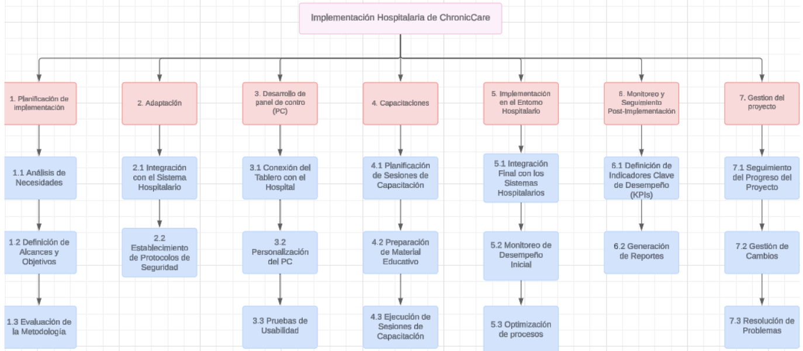
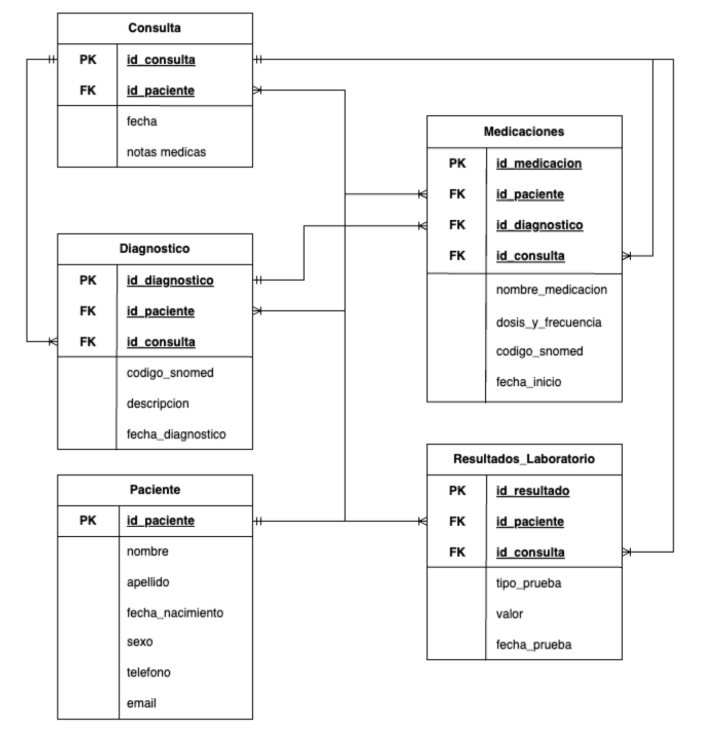

# Implementación Hospitalaria de ChronicCare

Este repositorio documenta el proceso de implementación hospitalaria del sistema **ChronicCare**. A continuación, se describe el trabajo realizado, junto con los entregables principales.

## 1. Desglose del Trabajo (EDT)

Se elaboró un **EDT (Estructura de Desglose del Trabajo)** para organizar y planificar las actividades del proyecto. El EDT se diseñó para dividir el proyecto en fases específicas, cada una compuesta por tareas claras y medibles. Esto permitió asegurar una gestión eficiente del tiempo, recursos y responsabilidades.

### Estructura del EDT

El proyecto se dividió en 7 fases principales:
1. **Planificación de Implementación**  
   - Análisis de necesidades, definición de objetivos y evaluación metodológica.  
2. **Adaptación**  
   - Integración con el sistema hospitalario y establecimiento de protocolos de seguridad.  
3. **Desarrollo del Panel de Control (PC)**  
   - Conexión del panel con el hospital, personalización y pruebas de usabilidad.  
4. **Capacitaciones**  
   - Planificación y ejecución de sesiones de formación.  
5. **Implementación en el Entorno Hospitalario**  
   - Integración final, monitoreo inicial y optimización de procesos.  
6. **Monitoreo y Seguimiento Post-Implementación**  
   - Definición de indicadores clave de desempeño (KPIs) y generación de reportes.  
7. **Gestión del Proyecto**  
   - Seguimiento continuo del progreso, gestión de cambios y resolución de problemas.  

## 2. Cronograma del Proyecto

Para gestionar el tiempo, se creó un **cronograma en formato Gantt** utilizando la herramienta **Jira**. El Gantt detalla la duración y dependencias entre las actividades de cada fase, asegurando que el proyecto se complete en el plazo de 3 meses (del 11 de diciembre de 2024 al 10 de marzo de 2025).

### Características del Cronograma
- **Fases críticas** como la planificación, adaptación y desarrollo se priorizaron para evitar retrasos.  
- Las tareas se organizaron con dependencias claras y plazos específicos.  
- El monitoreo y la gestión del proyecto se realizan de manera continua para garantizar el éxito de la implementación.  

[Ver cronograma en Jira](https://vaalenmedina.atlassian.net/jira/core/projects/GTM/summary?atlOrigin=eyJpIjoiZTEzNmUyNjM0ODQ0NDFhMmJhZjZiNjMwZDVmNTQ0YTEiLCJwIjoiaiJ9)

## 3. Diagrama Entidad-Relación

Modelo relacional de nuestra base de datos, que cuenta con las siguientes tablas: 
1. **Pacientes**: Datos personales y de contacto.
2. **Consultas**: Fechas y notas médicas asociadas al paciente.
3. **Diagnósticos**: Información clínica detallada basada en códigos SNOMED.
4. **Medicaciones**: Tratamientos prescritos con sus detalles.
5. **Resultados de Laboratorio**: Registro de pruebas médicas y sus resultados.

Cada tabla incluye claves primarias (PK) y foráneas (FK) que permiten vincular la información de manera eficiente, asegurando integridad y trazabilidad en los datos médicos.

---
