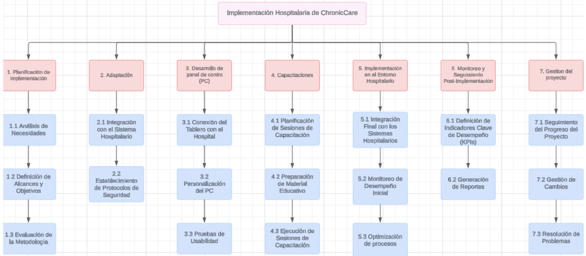
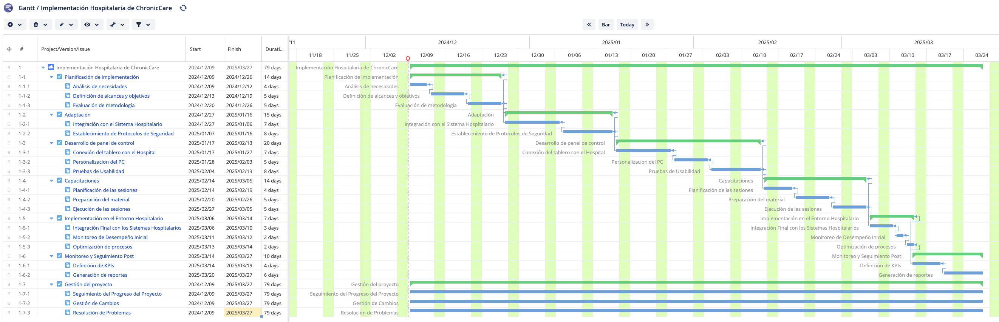
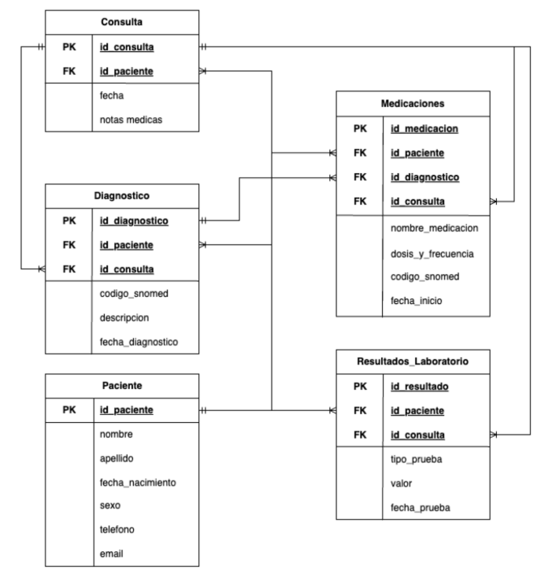

# Implementación Hospitalaria de ChronicCare

Este repositorio documenta el proceso de implementación hospitalaria del sistema **ChronicCare**. A continuación, se describe el trabajo realizado, junto con los entregables principales.

## 1. Desglose del Trabajo (EDT)

Se elaboró un **EDT (Estructura de Desglose del Trabajo)** para organizar y planificar las actividades del proyecto. El EDT se diseñó para dividir el proyecto en fases específicas, cada una compuesta por tareas claras y medibles. Esto permitió asegurar una gestión eficiente del tiempo, recursos y responsabilidades.

### Estructura del EDT

El proyecto se dividió en 7 fases principales:
1. **Planificación de Implementación**  
   - Análisis de necesidades, definición de objetivos y evaluación metodológica.  
2. **Adaptación**  
   - Integración con el sistema hospitalario y establecimiento de protocolos de seguridad.  
3. **Desarrollo del Panel de Control (PC)**  
   - Conexión del panel con el hospital, personalización y pruebas de usabilidad.  
4. **Capacitaciones**  
   - Planificación y ejecución de sesiones de formación.  
5. **Implementación en el Entorno Hospitalario**  
   - Integración final, monitoreo inicial y optimización de procesos.  
6. **Monitoreo y Seguimiento Post-Implementación**  
   - Definición de indicadores clave de desempeño (KPIs) y generación de reportes.  
7. **Gestión del Proyecto**  
   - Seguimiento continuo del progreso, gestión de cambios y resolución de problemas.  

## 2. Cronograma del Proyecto

Para gestionar el tiempo, se creó un **cronograma en formato Gantt** utilizando la herramienta **Jira**. El Gantt detalla la duración y dependencias entre las actividades de cada fase, asegurando que el proyecto se complete en el plazo de 3 meses (del 11 de diciembre de 2024 al 10 de marzo de 2025).

### Características del Cronograma
- **Fases críticas** como la planificación, adaptación y desarrollo se priorizaron para evitar retrasos.  
- Las tareas se organizaron con dependencias claras y plazos específicos.  
- El monitoreo y la gestión del proyecto se realizan de manera continua para garantizar el éxito de la implementación.  

[Ver cronograma en Jira](https://vaalenmedina.atlassian.net/jira/core/projects/GTM/summary?atlOrigin=eyJpIjoiZTEzNmUyNjM0ODQ0NDFhMmJhZjZiNjMwZDVmNTQ0YTEiLCJwIjoiaiJ9)

## 3. Diagrama Entidad-Relación

Modelo relacional de nuestra base de datos, que cuenta con las siguientes tablas: 
1. **Pacientes**: Datos personales y de contacto.
2. **Consultas**: Fechas y notas médicas asociadas al paciente.
3. **Diagnósticos**: Información clínica detallada basada en códigos SNOMED.
4. **Medicaciones**: Tratamientos prescritos con sus detalles.
5. **Resultados de Laboratorio**: Registro de pruebas médicas y sus resultados.

Cada tabla incluye claves primarias (PK) y foráneas (FK) que permiten vincular la información de manera eficiente, asegurando integridad y trazabilidad en los datos médicos.

## 4. Tablero en LookerStudio

Para poder visualizar de manera más comoda ciertos datos relevantes de las tablas de la base de datos, armamos un tablero en LookerStudio. Ademas es parte del sistema que queremos implementar ya que permite ver de manera facil, visual y resumida la información relevante de los pacientes.

[Ver tablero en LookerStudio](https://lookerstudio.google.com/s/jjKJdHLj0Pw)

---
